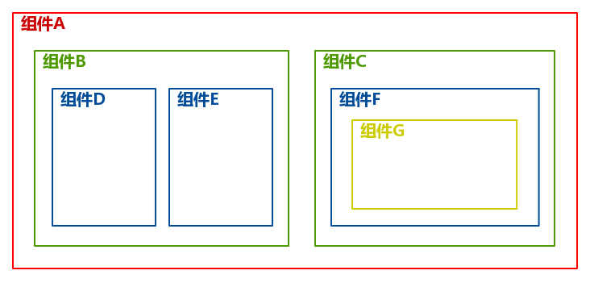

# React组件通信

`React`的基本元素是一个个的组件，组件之间存在各种关联关系。不同的组件之间，经常会发生数据传递、状态共享等行为，我们称之为组件间通信。

组件之间的相互关系：


- 嵌套关系

> 父子关系
>> `组件A`和`组件B`

> 跨级关系
>> `组件A`和`组件D`<br>

- 非嵌套关系

> `组件D`和`组件C`<br>
> `组件D`和`组件E`<br>
> `组件D`和`组件F`<br>
> `组件D`和`组件G`<br>

## 一、父子组件间通信
### 1. 父组件向子组件传递数据
> 父组件通过props向子组件传递数据。<br>
> 父组件的state状态发生变化，子组件与之对应的props也会发生变化。

代码示例`AtoB.js`[点击查看源码](../src/components/AtoB.js)：

```
// 父组件A
// 通过props向子组件B传递了一个number
// 每过1000ms 父组件A state的number值加1
// 子组件B props的number会随着父组件A一起变化
import React from 'react';
import { setInterval } from 'timers';

export default class A extends React.Component{
    constructor(){
        super();
        this.state={number:0}
    }

    componentDidMount(){
        // 每过 1000ms A组件state的number值加1
        setInterval(()=>{
            this.setState({
                number: this.state.number+1
            });
        },1000);
    }

    render(){
        return (<div>
            组件A的number值：{this.state.number}
            <B number={this.state.number}/>
        </div>)
    }
}

// 子组件B
class B extends React.Component{
    render(){
        return (<div>
            组件B的number值：{this.props.number}
        </div>);
    }
}
```

### 2. 子组件向父组件传递数据
> React是单向数据流，`子组件`向`父组件`通信，可以由`父组件`提供一个回调函数，供`子组件`调用并回传参数。

代码示例`BtoA.js` [点击查看源码](../src/components/BtoA.js)：

```
// 点击 子组件B 的按钮修改 父组件A state的 name
import React from 'react';
export default class A extends React.Component{
    constructor(){
        super();
        this.state = {
            name: '传智播客'
        };
    }
    // 父组件定义一个修改name的方法
    // 并传递给子组件
    changeName = (name)=>{
        this.setState({name});
    }
    render(){
        return(
            <div>
                父组件A中的name：{this.state.name}
                <B changeName={this.changeName}/>
            </div>
        )
    }
}

class B extends React.Component{
    render(){
        return(
            <div>
                点击 子组件B 的按钮调用 父组件A 传过来的changeName方法：<button onClick={()=>{this.props.changeName('黑马程序员')}}>修改名字</button>
            </div>
        )
    }
}
```

## 二、跨级组件间通信

所谓跨级组件通信，就是父组件向`子组件的子组件`通信，或者向`更深层的子组件`通信。跨级组件间通信可以采用下面两种方式：

- 层层组件传递`props`（不建议）

> 例如上图的`组件A`要和`组件E`通信，`组件A`先通过props把要传递的数据传递给`组件B`，然后在由`组件B`通过props把`组件A`传递过来的数据传递给`组件E`。<br><br>
> 这种方式有一个明显的缺点，如果组件结构较深，那么中间的每一层组件都要去传递 props，增加了复杂度，并且这些 props 并不是这些中间组件自己所需要的，会引起混乱。<br>
> 当组件层次在三层以内可以采用这种方式，当组件嵌套过深时，采用这种方式就需要斟酌了。

- 使用`context`对象

> `context`相当于一个全局容器，我们可以把要通信的内容放在这个容器中，这样一来，不管嵌套有多深，都可以随意取用。<br><br>
> 如果是`上级组件`向`下级组件`单向通信，可以使用变量；<br>
> 如果是`下级组件`向`上级组件`通信，同样可以由`上级组件`提供一个回调函数，供`下级组件`调用并回传参数。<br><br>
> 在使用 context 时，需要注意：<br>
> 1.上级组件使用静态属性`childContextTypes`声明自己支持`context`，并提供`context`中属性的`PropTypes`<br>
> 2.上级组件需要提供一个`getChildContext`函数，用以返回一个初始的`context`对象<br>
> 3.下级组件使用静态属性`contextTypes`声明自己需要使用`context`，并提供其需要使用的`context`属性的 `PropTypes`<br>
>>补充说明：<br>
>>`context`同样可以应在函数组件（无状态组件）上，只需将`context`作为第二个参数传入。<br>


### 1.`上级组件`向`下级组件`通信
代码示例`AtoD.js` [点击查看源码](../src/components/AtoD.js)：

```
import React from "react";
import PropTypes from "prop-types";

export default class A extends React.Component{
    constructor(){
        super();
        this.state = {
            color: 'red'
        }
    }
    // 上级组件申明自己支持的 context
    static childContextTypes={
        color: PropTypes.string
    }

    // 上级组件提供一个函数，用来返回相应的 context 对象
    getChildContext(){
        return {
            color: this.state.color
        }
    }

    changeColor=()=>{
        let color = '';
        if(this.state.color === 'red'){
            color = 'green';
        }else{
            color = 'red';
        }
        this.setState({
            color: color
        });
    }

    render(){
        return (<div style={{border:'solid 5px '+ this.state.color,padding:'10px'}}>
            <span>组件A</span><button onClick={this.changeColor}>修改A组件state中的color</button>
            <B/>
        </div>)
    }
}

const B = ()=>{
    return (<div style={{border:'solid 5px #999',padding:'10px'}}>
        <span>组件B</span>
        <D/>
    </div>)
}

class D extends React.Component{
    // 下级组件声明自己接受的上级组件的 context
    static contextTypes = {
        color:PropTypes.string
    }
    render(){
        return (<div style={{border:'solid 5px '+ this.context.color,padding:'10px'}}>
            <span>组件D</span>
        </div>)
    }
}

/*
// 函数组件（无状态组件）使用context
const D = (props, context)=>{
    return (<div style={{border:'solid 5px '+ context.color,padding:'10px'}}>
        <span>组件D</span>
    </div>)
}
D.contextTypes = {
    color:PropTypes.string
}*/
```

### 2.`下级组件`向`上级组件`通信
代码示例`DtoA.js` [点击查看源码](../src/components/DtoA.js)：

```
import React from "react";
import PropTypes from "prop-types";

export default class A extends React.Component{
    constructor(){
        super();
        this.state = {
            color: 'red'
        }
    }
    // 上级组件申明自己支持的 context
    static childContextTypes={
        color: PropTypes.string,
        changeColor: PropTypes.func
    }

    // 上级组件提供一个函数，用来返回相应的 context 对象
    getChildContext(){
        return {
            color: this.state.color,
            changeColor: this.changeColor
        }
    }

    changeColor=()=>{
        let color = '';
        if(this.state.color === 'red'){
            color = 'green';
        }else{
            color = 'red';
        }
        this.setState({
            color: color
        });
    }

    render(){
        return (<div style={{border:'solid 5px '+ this.state.color,padding:'10px'}}>
            <span>组件A</span>
            <B/>
        </div>)
    }
}

const B = ()=>{
    return (<div style={{border:'solid 5px #999',padding:'10px'}}>
        <span>组件B</span>
        <D/>
    </div>)
}

class D extends React.Component{
    // 下级组件声明自己接受的上级组件的 context
    static contextTypes = {
        color:PropTypes.string,
        changeColor: PropTypes.func
    }
    render(){
        return (<div style={{border:'solid 5px '+ this.context.color,padding:'10px'}}>
            <span>组件D</span>
            <button onClick={this.context.changeColor}>修改color值</button>
        </div>)
    }
}
```
## 三、非嵌套组件间通信
非嵌套组件，就是`没有包含关系的组件`，包括兄弟组件以及不在同一个父级中的非兄弟组件。非嵌套组件间通信可以采用下面两种方式：

- 利用二者共同的上级组件的`context`对象进行通信（不建议）

> 如果采用组件间共同的上级来进行中转，会增加子组件和父组件之间的耦合度，如果组件层次较深的话，找到二者公共的上级组件不是一件容易的事，所以不建议使用这种方式来实现非嵌套组件间的通信。

- 使用自定义事件实现

> 本课程给大家演示一下如何用自定义事件的方式来实现非嵌套组件间的通信。<br><br>
> 安装一个`events`包：<br>
> 
```
npm install events --save
```
> 新建一个 event.js，引入 events 包，并向外提供一个事件对象，供通信时使用：
>
```
import { EventEmitter } from "events";
export default new EventEmitter();
```
> 自定义事件是典型的`发布/订阅`模式，通过向事件对象上添加`事件监听器`和`触发事件`来实现组件间通信。

代码示例`DtoC.js` [点击查看源码](../src/components/DtoC.js)：

实现点击`D组件中的按钮`，修改`C组件的颜色`的功能

```
import React from "react";
import emitter from "../event"

export default class A extends React.Component{
    constructor(){
        super();
        this.state = {
            color: 'red'
        }
    }

    changeColor=()=>{
        let color = '';
        if(this.state.color === 'red'){
            color = 'green';
        }else{
            color = 'red';
        }
        this.setState({
            color: color
        });
    }

    render(){
        return (<div style={{border:'solid 5px '+ this.state.color,padding:'10px',color:'red'}}>
            <span>组件A</span>
            <B/>
            <C/>
        </div>)
    }
}

const B = ()=>{
    return (<div style={{border:'solid 5px gray',padding:'10px',color:'gray',marginTop:'20px'}}>
        <span>组件B</span>
        <D/>
    </div>)
}

class C extends React.Component{
    constructor(){
        super();
        this.state = {
            color: 'blue'
        }
    }
    componentDidMount(){
        // C组件在组件装载完成以后
        // 声明一个自定义事件
        this.eventEmitter = emitter.addListener('change-c-color',(color)=>{
            this.setState({
                color
            });
        })
    }
    // 组件销毁前移除事件监听
    componentWillUnmount(){
        emitter.removeListener(this.eventEmitter);
    }
    render(){
        return (<div style={{border:'solid 5px '+this.state.color,padding:'10px',color:+this.state.color,marginTop:'20px'}}>
            <span>组件C</span>
        </div>)
    }
}

class D extends React.Component{
    handleClick=(color)=>{
        emitter.emit('change-c-color',color)
    }
    render(){
        return (<div style={{border:'solid 5px green',padding:'10px',color:'green',marginTop:'20px'}}>
            <span>组件D </span>
            <button onClick={()=>{this.handleClick('yellow')}}>把组件C的颜色修改为yellow</button>
        </div>)
    }
}
```
### 四、总结
本节课咱们学习了`React`中组件的几种通信方式，分别是：

- 父组件向子组件通信：使用`props`传递`state`
- 子组件向父组件通信：使用`props`传递回调函数
- 跨级组件间通信：使用`context`对象
- 非嵌套组件间通信：使用事件订阅

> 事实上，在组件间进行通信时，这些通信方式都可以使用，区别只在于使用相应的通信方式的复杂程度和个人喜好，选择最合适的那一个。<br>
> 比如：通过事件订阅模式通信不止可以应用在非嵌套组件间，还可以用于跨级组件间，非嵌套组件间通信也可以使用`context`等。关键是选择最合适的方式。

> 当然，自己实现组件间的通信管理起来还是比较困难，因此出现了很多状态管理工具，如`Flux`、`Redux`等，使用这些工具使得组件间的通信更容易追踪和管理。

> 下一节课咱们学习`React`项目中常用的状态管理工具`Redux`。